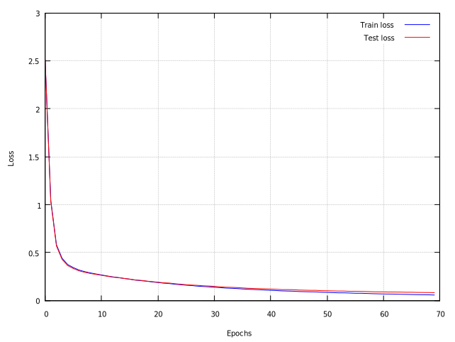

# Neural network implementation

## Overview
Feedforward neural network implementation in plain and simple C99.

Model fitting uses **Backpropagation** for gradients computation and can use **Gradient Descent**, **Mini-batch GD** and **Stochastic GD** depending on the fit options (see ```batch_size``` attribute of ```NN_train_opt``` in ```neural_network.h```).

The loss can be computed using the **Mean Squared Error** and **Cross-entropy** (see ```loss_type``` attribute of ```NN_train_opt``` in ```neural_network.h```).

The current supported activation functions are **Sigmoid**, **RELU**, **Tanh** and **Softmax**.\
There are three weights initialization strategies, **Uniform**, **Glorot** and **He**.

The API is well explained in the ```neural_network.h``` header file.
There are some examples on how to use it in the ```examples``` directory.

## How to build
Just
``` bash
make
```
And you'll find all the examples executables in the ```build_examples``` directory.

## Requirements
- Any C99-compatible compiler.
- gnuplot, just used for examples chart view (the example works anyway, logging the train data into a file).
- wget and gunzip command line utils, just used in Makefile for download and uncompress MNIST dataset.

## MNIST example
The ```mnist.c``` example train the neural network with the MNIST dataset, the results are not bad (train loss ~= 0.05, test loss ~= 0.08 with the configuration specified in ```opt```).\
Obviously the training is much slow, because all the the computation uses only the cpu, so I leave here the training chard if you don't want to wait:

